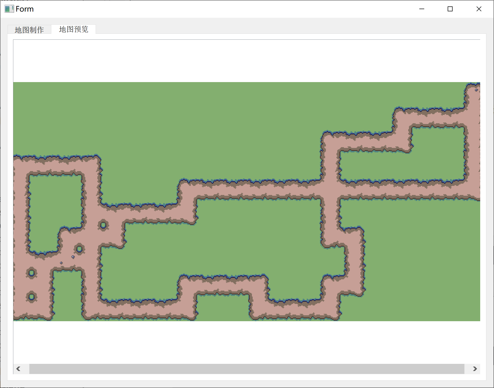
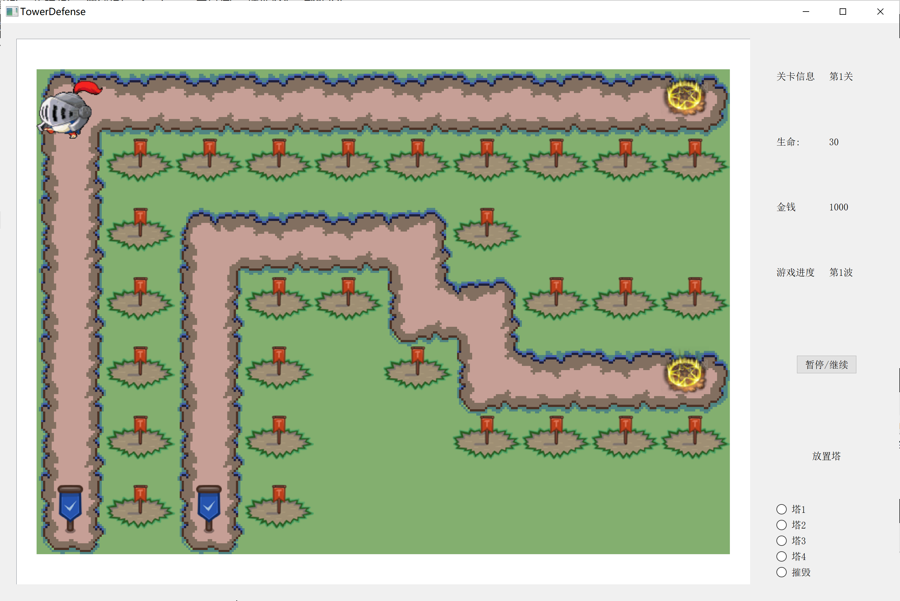
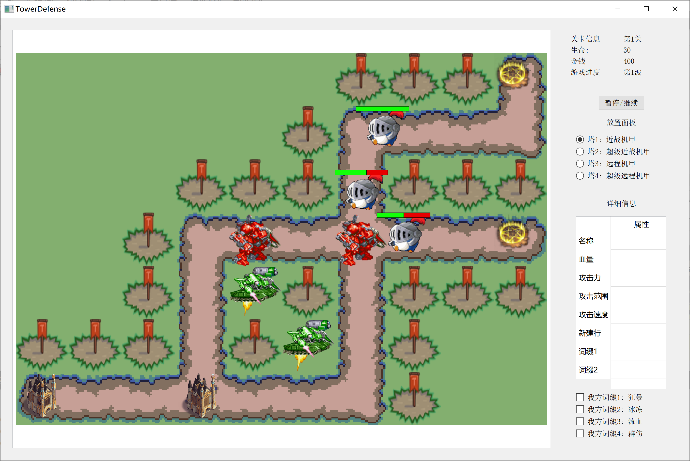
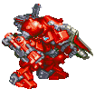
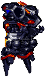

# TowerDenfense DevDoc

## TimeLine

- 阶段一: `地图创建`, `单位创建`, `交战机制`
- 阶段二: `地图导入/导出`, `词缀机制`
- 阶段三: `单位的动画特效(攻击和受伤效果)`
- 阶段四: `拓展`

---

## Game Settings

### Config

- `MAPMAXWIDTH`=20
- `MAPMAXHEIGHT`=10
- `GRIDWIDTH`=80
- `GRIDHEIGHT`=80


### Map

- size:
  - `mapWidth`=m, $10\le m\le 20$
  - `mapHeight`=n, $4\le n\le 10$

- `vector<path> pathList` 路径列表, 记录地图上的所有路径.

- `struct path` 路径, 一条路径对应一个起点和一个终点, 但是不同的路径的起点和终点可以重合.
  > 路径是怪物的行径路线, 每个怪物按照`路径id`进行运动, 
  > 
  > 对路径的要求: 整体的方向必须是从右至左, 即, 规定怪物的出生点一定是在最右边一列, 我方的终点一定是在最左边一列. 对于路径是向上还是向下不做要求. 此外, 要求路径不能相连, 即不能出现一个点于超过一个节点相邻的情况, 否则无法判断路径. 
  >
  > **优化** : 在点击grid的同时记录当前的路径, 同时对下一步可以点击的格子做出限制.
  - `startPoint` 起点坐标
  - `endPoint` 终点坐标
  - `vector<pair<int x, int y>> turingPointList` 拐点列表, 记录所有的关键节点: 路径拐弯的地方
  > [ex]`bool isSpecial` 特殊路径标识


#### 地图读写制作模块  MakeMap

- 从文件写入: 
  > 文件格式:
  > 第一行 width height
  >
  > 第二行: k 路径条数
  > 下面k行: num 表示关键节点个数, 下面num个(x,y)表示空间上的坐标. 规定原点在左上角.

文件示例:
  ```txt
    15 5 //说明14列 5行
    2    //说明有2条路径
    3 (0,14) (0, 2) (4,2) //说明这条路径的起点是(0,14) 终点是(4,2), 中间经过一个拐点
    2 (3,14) (3,0)        
  ```

- 根据数据渲染地图:
  用一个`bool isPainted[m][n]` 来记录方格是否被渲染.
  首先给出具体的范围
  然后沿着路径"铺地毯": 铺好关键路径, 注意起点和终点采用不同的贴图.

  然后对于剩下的非路径grid, 统一铺地毯.

- 地图制作功能:
  >给出图形化界面, 点击绘制路径.
  - 选择`新建文件`:
    1. 弹窗, 选择文件的保存路径
    2. 创建新文件, 得到文件路径显示在label里.
    3. 左下角界面中显示默认的$10\times 4$大小的**方格矩阵**(创建文件选择好路径后就显示, 可以就写在创建文件的pushbutton的connect里面, 写一个小的函数`createGrids(int row, int col)`, 负责在左下角的widget中创建方格矩阵, 由pushbutton组成, 具有`checkable`的属性, 即被选中后由区别显示, 表示选中为路径)
    4. [可选]调整地图的大小, 每次的调整都会触发`createGrids()`, 注意该函数会先清空widget区域内已经存在的grid.
    5. 在网格中勾选格子, 绘制路径, 完成之后点击保存, 触发`addPath()`函数, 负责写入当前的路径信息.
    6. 选择`添加路径`, 每次点击的时候会保存上一条路径信息, 恢复grid的未选中状态. 同时`comboBox`会增加到下一个idx
    7. [可选]回溯: 点击`comboBox`之前的idx, 会清除当前路径的记录, 读取之前的idx的路径信息, 再次显示在上面`showPath(int idx)`.
    8. 在完成所有的路径创建以后, 点击`保存`, 触发`saveMap()`, 将所有的地图信息写入文件.
  - 选择`选择文件`(注意, 需要保证文件的正确性):
    1. 弹窗, 选择文件, 得到文件路径, 显示在label里.
    2. 读取文件, 获得地图的行数, 列数, 路径数.
    3. 先触发`createGrids()`函数, 绘制网格, 然后触发`showPath(1)`函数, 默认显示第1条路径
    4. [可选]通过调整comboBox的idx, 调用`showPath(comboBox->idx)`, 显示每条路径的情况.
    5. [可选]修改路径: 通过修改网格的状态, 来修改当前路径的信息. 在完成修改后, 点击保存路径, 触发`savePath(idx)`函数, 保存信息
    6. [可选]修改大小: 修改行数和列数: 注意, 如果对已有文件修改行数和列数, 那么会**清空所有的已有路径**!
    7. [可选]增加路径: 同上.
    8. 在完成地图的制作后, 点击保存, 将所有的信息写入文件.

> **优化**: 做一个保存检测: 当检测到文件未保存但需要进行选择其他文件或者创建新文件时, 弹出警告; 完善取消保存的机制.


- 图片导出功能:
  - 文件导出模式: 导出可以再次被读取的文件
  - 图片预览模式: 将绘制的游戏地图导出成图片(**优化**: 使用`QGraphicsScene::render()`导出预览图片
  )
  > 
  > 
  > **优化**: 随机给非节点添加一些特别的草地背景(树木, 建筑等, 增加美观度.)

### GameWindow 游戏关卡类： 核心

#### 游戏信息读写机制

> 由于要求里没有指出需要每个关卡的怪物不同(**后期可以实现**), 因此就先写死, 每关的怪物按照制指定的规则生成, 不可自定义.

游戏开始时, 软件去`./info`文件中读取`config.txt`文件, 读取当前游戏有多少关卡, 玩家的游戏进度(当前玩到第几关, 金钱数量...), 并在comboBox中显示. 当玩家选择一个关卡数, 并点击`开始游戏`后, 创建`game(int level)`对象.

config.txt文件实例:
```txt
2 // 一共有两个关卡: 从0开始计数.
0 //当前处于第0关
```

该对象首先在`./map`文件夹下寻找`map%d.txt`文件, 读入地图信息. 然后渲染地图(将地图放入`QGraphicsScene`)中, 然后进入游戏.

Game类说明: 每开启一局游戏就相当于实例化一个Game对象, 需要传入关卡信息, 让后


#### properties

- `level` 当前是第几关, 作为参数传入, 同时显示在l_level标签上
- `money` 玩家当前的金币, 用于放置防御塔
- `life` 当前剩余生命值
- `maxLife` 当前关卡的最大生命值
- `int curProcess` 当前已经进行到第几波, [默认一共三波]
- `bool stop` TRUE时游戏停止, 时钟停止计时
- `QTimer globalTimer` 全局时钟, 理论上全局只有一个时钟, 作为统一的最小的时间单位.
- `QGraphicsScene *gameScene` 游戏场景.
- `vector<Tower *> towerList` 存放所有的塔的信息
- `vector<Enemy *> enemyList` 存放所有的怪物的信息


#### methods

- `loadMap()` 从对应的文件中读取地图信息, 作为预处理函数.
- `renderMap()` 预处理, 绘制地图格子, 同时给路径加上起点和终点的flag, 给草地上的可以放置远程塔的位置放置`slot`的对象, 用于作为可以点击的特殊格子.

> 路径节点和可以放置远程塔的格子都是**可以点击**的特殊格子. (预先选择radioBox中的选中状态), 然后双击某一个格子进行放置. 

- `move()` 每个单位时间内, 给每一个在场的怪物判定移动方向, 并给其一个移动的消息, 要求其移动.
- `attack()` 每个单位时间内, 给判定每一个怪物的攻击对象, 要求其对这个对象进行一次攻击. 塔同理.


### Enemy

- `enemyType` 词缀机制 
- `hp` 当前的血量
- `maxHp` 怪物最大的血量, 如果能够加血的话, 会有作用. 此外, 血条的设计也与此有关.
- `atk` 攻击力
- `atkRange` 攻击范围
- `atkSpeed` 攻击速度
- `moveSpeed` 移动速度
- `posX, posY` 坐标
- `bool isMovable`  置1表示能够移动, 否则不能移动
- `QPixmap/QMovie marchingAnimation` 敌人的行进动画
- `QMovie attackAnimation`  敌人的攻击动画
- `destroy()` 调用死亡动画, 触发析构函数
- `attack(Tower* t)` 系统告诉敌人该攻击谁, 因此怪物自身只需要判定能够实施攻击.
- `QPainterEvent` 绘制血条
- `move()` 更新坐标, 等于$isMovable \times moveSpeed\times moveDirection$
- `mousePressEvent()` 当点击敌人时, 会显示其攻击力, 攻击速度的信息.(***人物边框加粗标识被选中, 或者地上出现圆环表示被选中)
- `mouseReLeaseEvent()` 鼠标释放时恢复未被选中的状态.



#### 移动和攻击的机制

- 敌人创建机制

在`gameScene`中记录每一局会产生多少个怪物以及出怪频率(前期可以设置为每2s在每一条路径的起点出一个怪, 后期**优化**做出怪的详细机制, 包括有几波, 出多少怪, 依次在什么地方出), 办法是调用一个负责出怪的函数, 用一个cnt来记录当前是第多少个时间单元, 到达规定的时间单元后, 就在`enemyList`中创建一个新的怪物, 起点设置在对应路径的起点, 同时绑定这个怪物属于的路径, 后面就沿着这条路径进行移动.(需要写一个判断移动方向的函数`getMoveDirection`)

调用`advance()`函数对所有的怪物进行移动, 即修改他们的pos, 这样在paint里就能够体现.


**优化**: 四倍速

- 移动机制


人物的移动实际上包括了坐标的更新和动画的播放, 其中, 当人物被阻拦时, 依然会播放动画, 但是不能更新坐标.

- 攻击机制

攻击机制涉及全局所有的敌人实例和所有的塔的实例. 因此我认为判定谁该攻击谁这件事情最好由上层的系统层来做, 决定好了该敌人应该攻击谁后, 该敌人只需要对某个确定的塔进行尝试攻击即可. 否则, 需要给予怪物全局视野, 来判定该攻击谁, 框架层次有点混乱.

**优化** 我方防御塔通过透明度反应血量。

**攻击范围**的判定: 计算欧式距离.

#### 词缀机制

[TODO]

### 素材图鉴

> 地图的素材风格: 卡通, 类似宝可梦地图风格, 非路径的`grid`渲染就选择草地, 存在路径的`grid`就选择石子路, 这样的拼接效果会比较好.
>
> 人物的移动GIF最好选择是上下跳动(波比), 这样的动画效果会比较自然.

前期不实现动画, 统一用圆形代表敌人, 用正方形代表塔.


### Tower

> Tower只是一个广义的概念, 只代表我方单位.

- *`enemyType` 词缀机制 
- `hp` 当前的血量
- `maxHp` 塔最大的血量, 如果能够加血的话, 会有作用. 此外, 血条的设计也与此有关.
- `atk` 攻击力
- `atkRange` 攻击范围
  > 近战塔的攻击范围为1, 只能攻击$3\times 3$十字范围内的敌人.
- `atkSpeed` 攻击速度
- `posX, posY` 坐标
- **`QMovie attackAnimation`  塔的攻击动画 
  > 近战塔的攻击动画就是自身的动画, 远程塔的攻击动画还包括子弹的飞行动画.
- **`destroy()` 调用被摧毁动画, 触发析构函数
- `attack(Enemy* e)` 系统告诉塔该攻击谁, 因此自身只需要判定能够实施攻击.
- `QPainterEvent` 绘制血条
- ** `mousePressEvent()` 当点击敌人时, 会显示其攻击力, 攻击速度的信息, 还会以圆圈形式显示攻击范围.(***圆形用动画显示, 50%透明度)
- **`mouseReLeaseEvent()` 鼠标释放时恢复未被选中的状态.

#### 塔的放置机制

> 项目架构:
> 
> `GameWindow`->`GameScene`自定义的类型->`MapGrid/MapSlot/Tower/Enemy`(QGraphicsItem)

- 近战塔的放置机制

鼠标双击场景中的路径节点， 触发Scene的鼠标事件， 传递给对应的路径节点的对象， 触发其对应的鼠标事件， 发送给处理系统一个坐标信号， 通过信号槽绑定对应的创建塔的函数， 经过合法性判定后， 创建塔的实例，加入到场景对象中， 同时加入在线的塔的列表。

**摧毁机制** 同样是双击鼠标， 同样的触发对应的事件从而触发相同的型号， 根据此时的radioButton来判断是否进行摧毁的操作， 经过合法性判断， 从而摧毁该地的对象。

> **优化** 后面改为右键双击删除对象， 更简单

>  利用GRAphics Item的特性， 当某个格子处已经存在塔时， 无法点击到塔下面的格子， 因此不可能再次建立塔。

- 远程塔的放置机制

#### 进攻机制

攻击分为两种，塔对敌人， 敌人对塔

在时钟计时的每一个单位里， 对每个在线的塔维护一个最近的攻击的敌人，然后进行攻击判定， 距离的符合， 进行攻击， 


### System[Core]

> 负责整局游戏的维护. 包括怪物的生成, 塔的放置, 攻击判定

#### QGraphicsItem::UserType

定义:

- UserType + 1 = Enemy(Penguin)

- UserType + 2 = Tower

- UserType + 3 = Remote Tower

- UserType + 4 = MapGrid

- UserType + 5 = Wizard

- UserType + 6 = Vanguard

- UserType + 7 = DragonMaster

- UserType + 8 = CloudCat


#### 词缀系统



- 敌方词缀直接写死为不同的类型的怪物, 有:
  - 闪现怪: 能够跳过一个近战塔, 技能有冷却时间5s
  - 神速怪: 移动速度是一般的两倍
  - BOSS怪: 血量是一般怪物的5倍, 击杀解锁词缀

- 我方词缀是在击杀BOSS后解锁(表现为radioButton可以被选中, 可以进行安装)

初始状态设置4个词缀均不可被选中, 在击杀特定的Boss后, 会解锁对应的checkBox.

左键单击某一个我方塔既会显示详细信息, 又会在下面对应的checkBox里打钩, 表示已经装备了相应的词缀, 通过单击CheckBox来改变选中状态来进行安装/卸下.
> 注意: 在**尝试**进行安装时, 首先触发`QCheckBox::stateChanged(int)`函数, 接下来进行检测, 如果发现已经装上了两个词缀, 或者金币不足以安装词缀, 会安装失败, 将选中的状态改为未选中的状态.

卸下的机制就是单击卸下, 因为总是可以保证卸下的正确性.

- 狂暴: 安装-100/卸下+50
- 冰冻: 安装-200/卸下+100
- 流血: 安装-200/卸下+100
- 群伤: 安装-400/卸下+200

具体实现:

- 对于敌人的词缀, 就相当于多写几种怪(无词缀: 白班; 闪现: 精英怪1; 神速: 精英怪2; 闪现神速: 精英怪3; BOSS: 4种), 直接写敌人基类的几个派生类即可.

- 对于防御塔的词缀, 是在基类内部增加几个特殊的标识, 如果标识存在, 则说明装备了这种词缀, 在对应的函数内部预留是否存在标识的判断即可.


#### 图鉴系统

##### 敌人

1.皇家企鹅 Penguin


陪伴作者趟过不知道多少个bug仍然坚挺的原始怪物.

2.圣灵法师 Wizard


神秘的法杖使它具有穿越一个近战敌人的阻挡的能力, 不过穿越过后法杖也需要一些时间恢复.

3.急先锋 Vanguard


芜湖, 起飞飞飞飞飞飞飞!

4.驯龙法师 DragonMaster


驯服了巨龙的圣灵法师. 飞得快, 还能穿越近战塔.

5.[BOSS] 祥云喵喵 CloudCat


击杀会解锁一个强化词缀! 就是血厚了亿点...

击杀会随机解锁一种我方防御塔词缀

??? 隐藏BOSS 菜虚鲲 CXK


数值666.(没错, 所有的数值均为666)

> **优化** 击杀赏金: 不同类型击杀返回不同的金币

##### 防御塔

近战塔



远程塔


[TODO]超级近战塔



[TODO]超级远程塔

