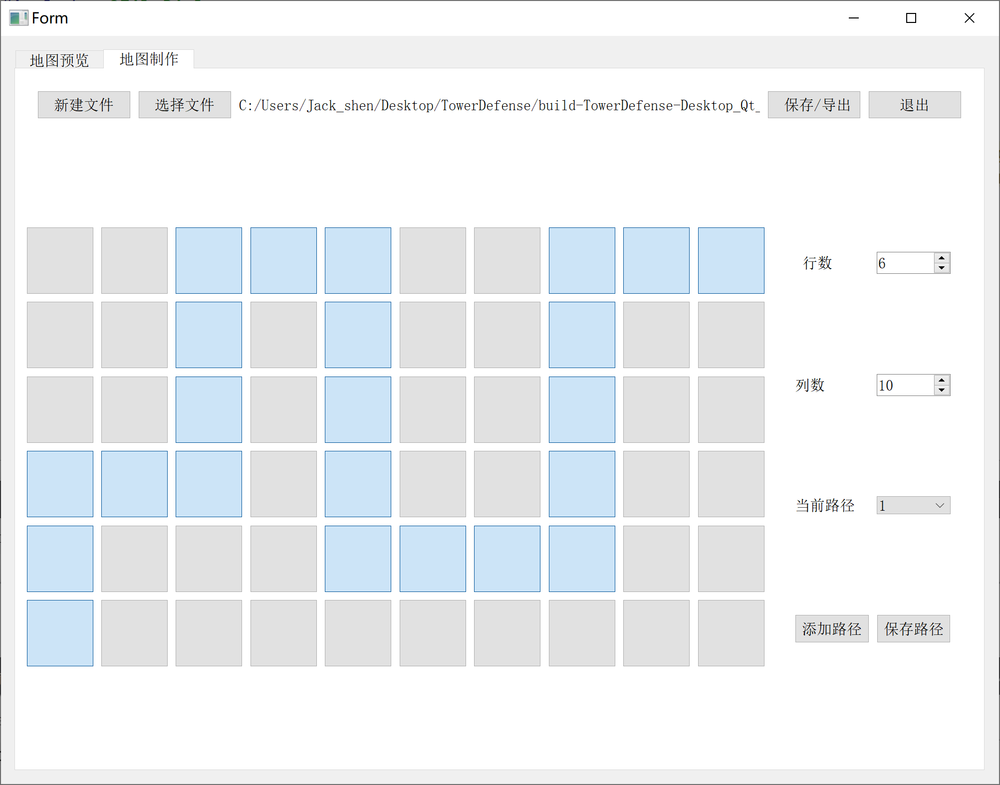

> # TowerDenfense DevDoc
>
> ## TimeLine
>
> - 阶段一: `地图创建`, `单位创建`, `交战机制`
> - 阶段二: `地图导入/导出`, `词缀机制`
> - 阶段三: `单位的动画特效(攻击和受伤效果)`
> - 阶段四: `拓展`
>
> ---
>
> ## Game Settings
>
> ### Config
>
> - `MAPMAXWIDTH`=20
> - `MAPMAXHEIGHT`=10
> - `GRIDWIDTH`=80
> - `GRIDHEIGHT`=80
>
>
> ### Map
>
> - size:
>   - `mapWidth`=m, $10\le m\le 20$
>   - `mapHeight`=n, $4\le n\le 10$
>
> - `vector<path> pathList` 路径列表, 记录地图上的所有路径.
>
> - `struct path` 路径, 一条路径对应一个起点和一个终点, 但是不同的路径的起点和终点可以重合.
>   > 路径是怪物的行径路线, 每个怪物按照`路径id`进行运动, 
>   > 
>   > 对路径的要求: 整体的方向必须是从右至左, 即, 规定怪物的出生点一定是在最右边一列, 我方的终点一定是在最左边一列. 对于路径是向上还是向下不做要求. 此外, 要求路径不能相连, 即不能出现一个点于超过一个节点相邻的情况, 否则无法判断路径. 
>   >
>   > **优化** : 在点击grid的同时记录当前的路径, 同时对下一步可以点击的格子做出限制.
>   - `startPoint` 起点坐标
>   - `endPoint` 终点坐标
>   - `vector<pair<int x, int y>> turingPointList` 拐点列表, 记录所有的关键节点: 路径拐弯的地方
>   > [ex]`bool isSpecial` 特殊路径标识
>
>
> #### 地图读写制作模块  MakeMap
>
> - 从文件写入: 
>   > 文件格式:
>   > 第一行 width height
>   >
>   > 第二行: k 路径条数
>   > 下面k行: num 表示关键节点个数, 下面num个(x,y)表示空间上的坐标. 规定原点在左上角.
>
> 文件示例:
>   ```txt
>     15 5 //说明14列 5行
>     2    //说明有2条路径
>     3 (0,14) (0, 2) (4,2) //说明这条路径的起点是(0,14) 终点是(4,2), 中间经过一个拐点
>     2 (3,14) (3,0)        
>   ```
>
> - 根据数据渲染地图:
>   用一个`bool isPainted[m][n]` 来记录方格是否被渲染.
>   首先给出具体的范围
>   然后沿着路径"铺地毯": 铺好关键路径, 注意起点和终点采用不同的贴图.
>
>   然后对于剩下的非路径grid, 统一铺地毯.
>
> - 地图制作功能:
>   >给出图形化界面, 点击绘制路径.
>   - 选择`新建文件`:
>     1. 弹窗, 选择文件的保存路径
>     2. 创建新文件, 得到文件路径显示在label里.
>     3. 左下角界面中显示默认的$10\times 4$大小的**方格矩阵**(创建文件选择好路径后就显示, 可以就写在创建文件的pushbutton的connect里面, 写一个小的函数`createGrids(int row, int col)`, 负责在左下角的widget中创建方格矩阵, 由pushbutton组成, 具有`checkable`的属性, 即被选中后由区别显示, 表示选中为路径)
>     4. [可选]调整地图的大小, 每次的调整都会触发`createGrids()`, 注意该函数会先清空widget区域内已经存在的grid.
>     5. 在网格中勾选格子, 绘制路径, 完成之后点击保存, 触发`addPath()`函数, 负责写入当前的路径信息.
>     6. 选择`添加路径`, 每次点击的时候会保存上一条路径信息, 恢复grid的未选中状态. 同时`comboBox`会增加到下一个idx
>     7. [可选]回溯: 点击`comboBox`之前的idx, 会清除当前路径的记录, 读取之前的idx的路径信息, 再次显示在上面`showPath(int idx)`.
>     8. 在完成所有的路径创建以后, 点击`保存`, 触发`saveMap()`, 将所有的地图信息写入文件.
>   - 选择`选择文件`(注意, 需要保证文件的正确性):
>     1. 弹窗, 选择文件, 得到文件路径, 显示在label里.
>     2. 读取文件, 获得地图的行数, 列数, 路径数.
>     3. 先触发`createGrids()`函数, 绘制网格, 然后触发`showPath(1)`函数, 默认显示第1条路径
>     4. [可选]通过调整comboBox的idx, 调用`showPath(comboBox->idx)`, 显示每条路径的情况.
>     5. [可选]修改路径: 通过修改网格的状态, 来修改当前路径的信息. 在完成修改后, 点击保存路径, 触发`savePath(idx)`函数, 保存信息
>     6. [可选]修改大小: 修改行数和列数: 注意, 如果对已有文件修改行数和列数, 那么会**清空所有的已有路径**!
>     7. [可选]增加路径: 同上.
>     8. 在完成地图的制作后, 点击保存, 将所有的信息写入文件.
>
> > **优化**: 做一个保存检测: 当检测到文件未保存但需要进行选择其他文件或者创建新文件时, 弹出警告; 完善取消保存的机制.
>
> 
>
> - 图片导出功能:
>   - 文件导出模式: 导出可以再次被读取的文件
>   - *图片导出模式: 将绘制的游戏地图导出成图片
>
>
> ### Enemy
>
> - `enemyType` 词缀机制 
> - `hp` 当前的血量
> - `maxHp` 怪物最大的血量, 如果能够加血的话, 会有作用. 此外, 血条的设计也与此有关.
> - `atk` 攻击力
> - `atkRange` 攻击范围
> - `atkSpeed` 攻击速度
> - `moveSpeed` 移动速度
> - `isMovable` 当前是否能够给移动的状态, 如果被阻塞(遇到近战塔), 则不能移动
> - `posX, posY` 坐标
> - `moveDirection` 移动的方向()
> - `QPixmap/QMovie marchingAnimation` 敌人的行进动画
> - `QMovie attackAnimation`  敌人的攻击动画
> - `destroy()` 调用死亡动画, 触发析构函数
> - `attack(Tower* t)` 系统告诉敌人该攻击谁, 因此怪物自身只需要判定能够实施攻击.
> - `QPainterEvent` 绘制血条
> - `move()` 更新坐标, 等于$isMovable \times moveSpeed\times moveDirection$
> - `mousePressEvent()` 当点击敌人时, 会显示其攻击力, 攻击速度的信息.(***人物边框加粗标识被选中, 或者地上出现圆环表示被选中)
> - `mouseReLeaseEvent()` 鼠标释放时恢复未被选中的状态.
>
> #### 移动和攻击的机制
>
> - 移动机制
>
> 人物在$80\times80$的格子上运动, 人物的贴图的右下角为其坐标, 人物的运动坐标总是沿着方格的下边线和右边线, 大体上的运动路线是自右至左, 自上至下. 
>
> 人物的移动实际上包括了坐标的更新和动画的播放, 其中, 当人物被阻拦时, 依然会播放动画, 但是不能更新坐标.
>
> - 攻击机制
>
> 攻击机制涉及全局所有的敌人实例和所有的塔的实例. 因此我认为判定谁该攻击谁这件事情最好由上层的系统层来做, 决定好了该敌人应该攻击谁后, 该敌人只需要对某个确定的塔进行尝试攻击即可. 否则, 需要给予怪物全局视野, 来判定该攻击谁, 框架层次有点混乱.
>
> **攻击范围**的判定: 计算欧式距离.
>
> #### 词缀机制
>
> [TODO]
>
> ### 素材图鉴
>
> > 地图的素材风格: 卡通, 类似宝可梦地图风格, 非路径的`grid`渲染就选择草地, 存在路径的`grid`就选择石子路, 这样的拼接效果会比较好.
> >
> > 人物的移动GIF最好选择是上下跳动(波比), 这样的动画效果会比较自然.
>
> 前期不实现动画, 统一用圆形代表敌人, 用正方形代表塔.
>
>
> ### Tower
>
> > Tower只是一个广义的概念, 只代表我方单位.
>
> - *`enemyType` 词缀机制 
> - `hp` 当前的血量
> - `maxHp` 塔最大的血量, 如果能够加血的话, 会有作用. 此外, 血条的设计也与此有关.
> - `atk` 攻击力
> - `atkRange` 攻击范围
>   > 近战塔的攻击范围为1, 只能攻击$3\times 3$十字范围内的敌人.
> - `atkSpeed` 攻击速度
> - `posX, posY` 坐标
> - **`QMovie attackAnimation`  塔的攻击动画 
>   > 近战塔的攻击动画就是自身的动画, 远程塔的攻击动画还包括子弹的飞行动画.
> - **`destroy()` 调用被摧毁动画, 触发析构函数
> - `attack(Enemy* e)` 系统告诉塔该攻击谁, 因此自身只需要判定能够实施攻击.
> - `QPainterEvent` 绘制血条
> - ** `mousePressEvent()` 当点击敌人时, 会显示其攻击力, 攻击速度的信息, 还会以圆圈形式显示攻击范围.(***圆形用动画显示, 50%透明度)
> - **`mouseReLeaseEvent()` 鼠标释放时恢复未被选中的状态.
>
> ### System[Core]
>
> > 负责整局游戏的维护. 包括怪物的生成, 塔的放置, 攻击判定